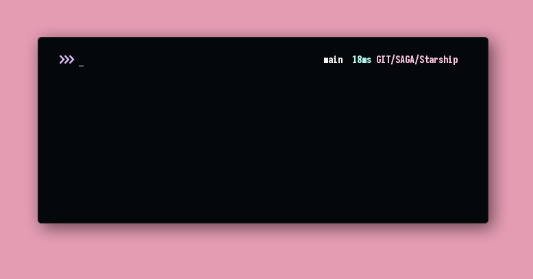

# SAGA for Starship
A dark theme for [Starship](https://starship.rs).



## Installation
```
mkdir $HOME/.config/starship
wget -p $HOME/.config/starship https://raw.githubusercontent.com/SAGAtheme/Starship/master/starship.toml $
```

## Notes
- You will need a [Nerd Font](https://github.com/ryanoasis/nerd-fonts) and [Material Design Icons](https://github.com/google/material-design-icons) installed in order for the icons to render. You can replace the icons in starship.toml if you wish to use a different set. 

## License

[MIT License](./LICENSE)
